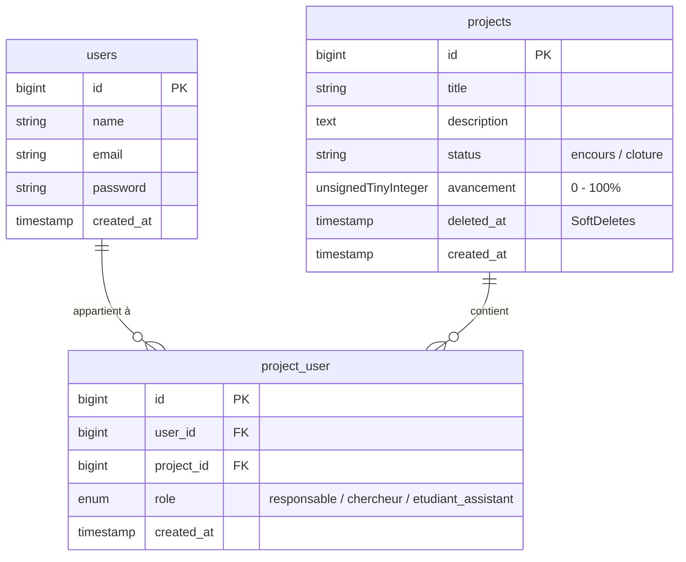

# 🧪 Grimoire — Système de Gestion de Projets de Recherche Universitaire


---

## 📌 À propos du projet

**Grimoire** est une application web conçue pour les laboratoires de recherche universitaires chez **TechLab Solutions**. Elle remplace la gestion manuelle par tableurs et e-mails par une plateforme centralisée avec :
- **Authentification sécurisée** et gestion fine des permissions par projet.
- **Rôles contextuels par projet** (Responsable, Chercheur, Étudiant Assistant) stockés via table pivot.
- **Archivage sécurisé** des projets (SoftDeletes).
- **Traitements asynchrones (Queues/Events/Listeners)** pour la notification des membres et la génération des rapports de clôture.

---

## 👥 Règles de Gestion & Rôles par Projet

Chaque utilisateur possède un rôle propre **au sein de chaque projet** (`project_user` pivot table) :

| Rôle | Consultation | Modification Info Générale | Mise à jour Avancement | Gestion de l'Équipe | Suppression / Archivage |
| :--- | :---: | :---: | :---: | :---: | :---: |
| **Responsable** | ✅ Oui | ✅ Oui | ✅ Oui | ✅ Ajouter / Retirer | ✅ SoftDelete / Clôture |
| **Chercheur** | ✅ Oui | ❌ Non | ✅ Oui (`avancement %`) | ❌ Non | ❌ Non |
| **Étudiant Assistant** | ✅ Oui | ❌ Non | ❌ Non (Lecture seule) | ❌ Non | ❌ Non |

### 🔒 Règles Métier Clés
1. **Responsable Obligatoire** : Un projet doit **toujours posséder au moins un responsable**. Impossible de retirer le dernier responsable sans en nommer un autre.
2. **Archivage (SoftDeletes)** : La suppression d'un projet est un archivage temporaire. Le projet disparaît des listes actives mais reste consultable/restaurable par le responsable.
3. **Traitements Asynchrones** :
   - **Ajout de membre** → Déclenche l'événement `MembreAjouteAuProjet` pour notifier le membre via la file d'attente (Queue).
   - **Clôture de projet** → Déclenche l'événement `ProjetCloture` pour générer un rapport de synthèse en arrière-plan.
4. **Sécurité & Middleware** : Toute la gestion de projet exige un compte connecté (Redirection automatique vers `/login` pour les visiteurs).

---

## 🚀 Couverture des User Stories (US)

- [x] **US1** : Inscription et connexion utilisateur (Auth Breeze).
- [x] **US2** : Création d'un projet par un Responsable (Créateur devient automatiquement Responsable).
- [x] **US3** : Ajout de membre avec attribution de rôle (Chercheur / Étudiant Assistant).
- [x] **US4** : Retrait d'un membre avec contrôle du dernier responsable.
- [x] **US5** : Notification asynchrone envoyée au membre à son ajout (`ShouldQueue`).
- [x] **US6** : Consultation et mise à jour de l'avancement (`avancement %`) par un Chercheur.
- [x] **US7** : Consultation en lecture seule par l'Étudiant Assistant.
- [x] **US8** : Clôture du projet et génération asynchrone du rapport de synthèse.
- [x] **US9** : Affichage conditionnel des actions dans l'interface selon le rôle (`@can` / Policies).
- [x] **US10** : Redirection automatique des visiteurs vers `/login`.

---

## 🗄️ Structure de la Base de Données



---

## ⚙️ Guide d'Installation & Configuration

### 1. Prérequis
- **PHP** >= 8.2
- **Composer** >= 2.x
- **Node.js** >= 18.x & NPM
- **MySQL / MariaDB**

### 2. Cloner & Installer les Dépendances

```bash
# Cloner le dépôt
git clone https://github.com/votre-compte/grimoire.git
cd grimoire

# Installer les dépendances PHP
composer install

# Installer les dépendances JavaScript
npm install
```

### 3. Configuration de l'Environnement

```bash
# Copier le fichier d'environnement
cp .env.example .env

# Générer la clé d'application
php artisan key:generate
```

Configurez les accès à votre base de données dans `.env` :

```ini
DB_CONNECTION=mysql
DB_HOST=127.0.0.1
DB_PORT=3306
DB_DATABASE=grimoire
DB_USERNAME=root
DB_PASSWORD=

QUEUE_CONNECTION=database
```

### 4. Migration & Seeding de la Base de Données

```bash
# Executer les migrations et alimenter la base de données
php artisan migrate:fresh --seed
```

#### Comptes de test générés par le Seeder :
- **Responsable** : `responsable@test.com` / `password`
- **Chercheur** : `chercheur@test.com` / `password`
- **Étudiant** : `etudiant@test.com` / `password`

### 5. Lancer l'Application & la Queue Worker

Ouvrez 3 terminaux distincts :

```bash
# Terminal 1 : Serveur Web Laravel
php artisan serve

# Terminal 2 : Queue Worker (Notifications & Rapports asynchrones)
php artisan queue:work

# Terminal 3 : Compilateur d'actifs Tailwind / Vite
npm run dev
```

Accédez ensuite à l'application sur [http://localhost:8000](http://localhost:8000).

---

## 🧪 Tests & Audit de Performance

### Tests unitaires & de fonctionnalités :
```bash
php artisan test
```

### Audit des requêtes (N+1 Query Prevention) :
L'application utilise le chargement anxieux (`with('users')`) sur les relations des projets pour éliminer les problèmes de performance N+1.

---

## 🛠️ Stack Technique

- **Framework** : Laravel 11
- **Auth** : Laravel Breeze
- **Front-end** : Blade, Tailwind CSS, Alpine.js
- **Asynchrone** : Laravel Queues & Event-Listener Pattern
- **ORM** : Eloquent (avec SoftDeletes & Pivot Table)

---

## 📄 Licence

Ce projet est sous licence [MIT](LICENSE). Développé pour **TechLab Solutions**.
